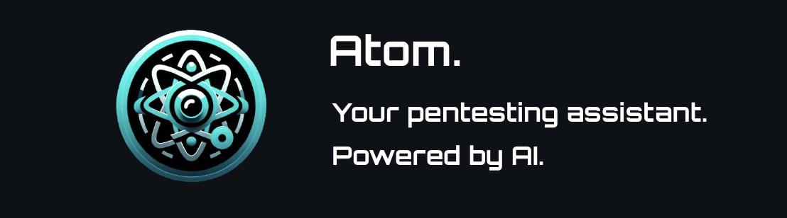

# Atom: Your Penetration Testing Assistant



## Overview

Atom is a state-of-the-art penetration testing (pentest) assistant designed to empower security professionals and enthusiasts alike. By leveraging the power of GPT-4 for advanced prompt engineering, Atom provides a conversational interface to assist users in mapping, understanding, and exploiting their attack surface with unparalleled efficiency and insight.

### What is Penetration Testing?

Penetration Testing, or pentesting, is a simulated cyber attack against your computer system to check for exploitable vulnerabilities. In the context of web application security, pentesting is used to augment a web application firewall (WAF).

Pentesting can involve the attempted breaching of any number of application systems, (e.g., application protocol interfaces (APIs), frontend/backend servers) to uncover vulnerabilities, such as unsanitized inputs that are susceptible to code injection attacks.

### Features

- **Attack Surface Mapping:** Atom helps map out the attack surface, providing a clear view of potential entry points for penetration testing.
- **Dynamic Attack Path Generation:** Atom dynamically maps attack paths tailored to the specific attack surface, allowing for a customized approach to each pentest.
- **Conversational Interface:** Engage with Atom in a chat-like interface, making pentesting more intuitive and accessible. Atom stays fully informed about the current pentest data at all times.
- **CVE Research:** Atom can automatically research Common Vulnerabilities and Exposures (CVEs) using the NIST vulnerability database and ExploitDB, ensuring up-to-date vulnerability and exploit data.
- **Command Generation:** Atom provides ready-to-use commands, complete with target IPs and specific command-line arguments, streamlining the testing process.
- **API Server:** A comprehensive API server with numerous endpoints supports automation and integration with other tools.
- **Detailed Documentation:** The UI includes detailed API documentation, making it easy for users to understand and utilize Atom's full capabilities.

## Getting Started

### Prerequisites

Ensure you have Python 3 installed on your system. Atom's dependencies are listed in `requirements.txt`, which can be installed using pip.

### Installation

1. Clone this repository or download the ZIP file.
2. Navigate to the Atom directory.
3. Install the required Python packages:

```sh
pip3 install -r requirements.txt
```

### Running Atom

To run Atom's server:

```sh
python3 server.py
```

To access Atom's user interface (UI), both the server and the UI need to be running concurrently:

1. Start the server:

```sh
python3 server.py
```

2. In a separate terminal, start the UI:

```sh
python3 ui.py
```

## Using Atom

Once the server and UI are running, access Atom's UI through your web browser to start your pentesting session. Atom's conversational interface will guide you through mapping your attack surface, researching vulnerabilities, and crafting your attack path.

Refer to the detailed API documentation included in the UI for information on how to extend Atom's functionality or integrate it with your existing tools and workflows.

## Video Overview

For a comprehensive overview and a demo of Atom in action, check out this example video:

https://youtu.be/uWRG7rv38jI
